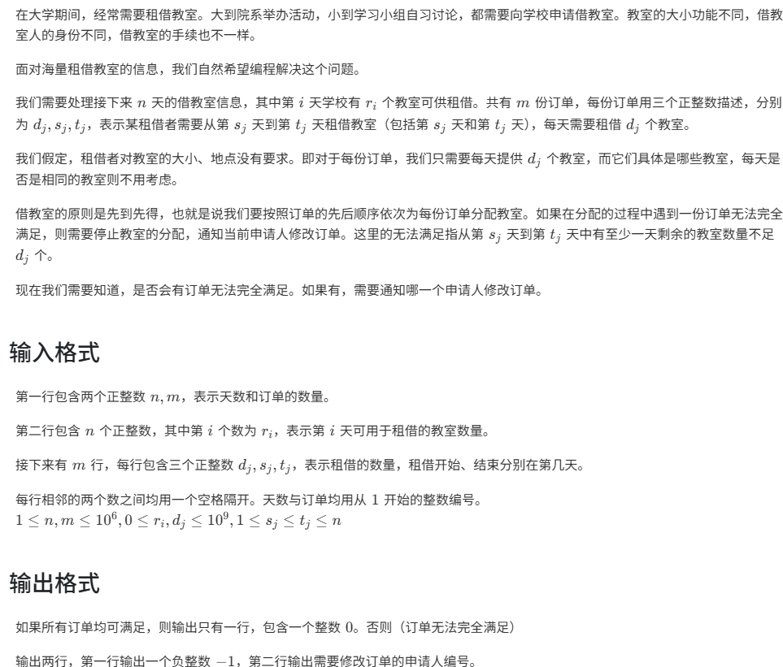
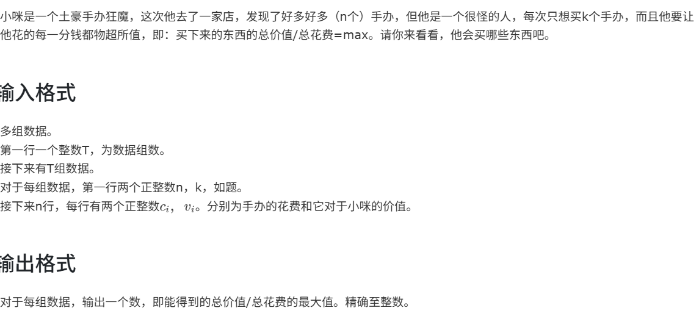

# 例题

---


## <mark>排队接水</mark>

知识点：

`下标索引的理解`,选择排序，原始编号移动，前缀和  


解法：

```c++
#include <bits/stdc++.h>
using namespace std;
int main(){
    int n;
    cin>>n;
    double time[n];
    int original_index[n];//设立原始编号，很重要
    for(int i = 0;i<n;i++){
        cin>>time[i];
        original_index[i] = i+1;
    }
    for(int i = 0;i<n;i++){
        int minindex = i;
        for(int j = i+1;j<n;j++){
            if(time[j]<time[minindex]){//利用选择排序从小到大选出索引，完成第一行输出
                minindex = j;
            }
        }
        cout<<original_index[minindex]<<" ";
        swap(time[i],time[minindex]);//防止重复，还是需要交换元素
        swap(original_index[i],original_index[minindex]);//原始编号也要跟着它主人一起移动交换
    }
    cout<<endl;
    double sum = 0;

    double pre[n];//计算每个人除了自己接水，需要额外等待的时间
    pre[0] = 0;//第一个人额外等待时间为0
    for(int i = 1;i<n;i++){//从第二个人开始
        pre[i] = time[i-1]+pre[i-1];//等于他前一个人接水时间加上前一个人额外等待时间
    }

    for(int i = 0;i<n;i++){//计算等待总时间
        sum = sum+pre[i];//修改为正确的等待时间
    }
    double average = sum/n;
    cout<<fixed<<setprecision(3)<<average;
    return 0;
}
```

重点在于原始编号按题目要求改变后，能够正确输出

---

## <mark>自然数的拆分</mark>

知识点：

`深度优化搜索DFS`,全局变量，一些语法和编程习惯


解法：

```c++
#include <bits/stdc++.h>
using namespace std;
vector<string> results;//设置全局变量
void dfs(int remain,int start,string current){
    if(remain==0){
        results.push_back(current);//如果remain已经为0，说明完成一种拆分方法，将它存入results
        return;
    }
    for(int i = start;i<=remain;i++){//先从从1到n选一个数
        string new_current;//开一个新的拆分方法
        if(current.empty()){
            new_current = to_string(i);
        }else{
            new_current = current+"+"+to_string(i);
        }
        dfs(remain-i,i,new_current);//相当于，例如n=7，已经选了一个1，再考虑剩下的6怎么拆......
    }
}
int main(){
    int n;
    cin>>n;
    dfs(n,1,"");//读入
    sort(results.begin(),results.end());//按字典序升序排列（题目要求）
    for(int i = 0;i<results.size();i++){
        if(results[i]==to_string(n)){//去掉最后的n=n
            results.erase(results.begin()+i);//erase必须要访问变量的地址，不能用results[i]
            i--;//此题其实不需要i--，但是如果有多个n=n就需要，保持好习惯
        }
    }
    for(int i = 0;i<results.size();i++){
        cout<<n<<"="<<results[i]<<endl;
    }
    return 0;
}
```

**全局变量**在main（）函数外，所有函数都可以直接使用这个变量

细节很多，慢慢品......

---

## <mark>字符串处理</mark>

知识点：预留空间，`+=`的好处，字符到数值的前缀和

题目：


解法：

```c++
#include<bits/stdc++.h>
using namespace std;
#define ll long long
int main(){
    string s;
    s.reserve(1000005);
    for(int i = 1;s.size()<=1e6;i++){
        string temp = to_string(i);
        for(int j = 1;j<=i;j++){
            s += temp;//完成这个大字符串创建
        }
    }
    int t;
    cin>>t;
    ll presum[1000005] = {0};
    for(ll i = 1;i<=1e6;i++){
        presum[i] = presum[i-1]+(s[i-1]-'0');//甜菜前缀和，直接把字符转换为数值了
    }
    while(t--){
        ll l,r;
        cin>>l>>r;
        ll sum = presum[r]-presum[l-1];
        cout<<sum<<endl;
    }
}
```

---

## <mark>求f的表达式</mark>

知识点：递归函数入门

题目：


解法：

```c++
#include <bits/stdc++.h>
using namespace std;
double f(double x, int n, int m) {//基本的递归写法，常看常新哦
    double result = sqrt(m + x);
    if (m < n) {
        return f(result, n, m + 1);
    } else {
        return result;
    }
}
int main() {
    int t;
    scanf("%d", &t);
    while (t--) {
        double x;
        int n;
        scanf("%lf %d", &x, &n);
        double result = f(x, n, 1);//每次从m=1开始
        printf("%.3f\n", result);
    }
    return 0;
}
```


---

## <mark>活动的选择</mark>

知识点：贪心，区间衔接，sort排序

题目：


解法：

```c++
#include <bits/stdc++.h>
using namespace std;
struct timeq{
    int begin;
    int end;
};
int main(){
    int n;
    cin>>n;
    vector<timeq> activ(n);
    for(int i = 0;i<n;i++){
        cin>>activ[i].begin>>activ[i].end;
    }
    for(int i = 0;i<n-1;i++){
        for(int j = 0;j<n-1-i;j++){
            if(activ[j].end>activ[j+1].end){
                swap(activ[j],activ[j+1]);//按结束时间从早到晚排序，结束越早的排前面，最后能够排更多个数
            }
        }
    }
    int cnt = 1;
    for(int i = 0;i<n;){
        int j = i+1;
        while(j<n && activ[i].end>activ[j].begin){//从第一个最早结束的活动开始，向后寻找第一个匹配的活动
            j++;
        }
        //此刻在while结束后找到了一个j
        if(j<=n-1){
            cnt++;
            i = j;
        }else{
            break;//若j已经超出活动数量n，直接结束就可以了
        }
    }
    cout<<cnt;
    return 0;
}
```

---

## <mark>2的幂次方表示</mark>

知识点：主要还是`递归`吧 有点麻烦

题目：在ZJNU的Oline Judge上吧

解法：

```c++
#include <bits/stdc++.h>
using namespace std;
string solve(int n){
    if(n==1)return "2(0)";//雷霆递归（哭
    if(n==2)return "2";
    string result = "";
    for(int power = 14;power>-1;power--){
        int two_power = 1;
        for(int j = 0;j<power;j++){
            two_power = two_power*2;
        }
        if(n>=two_power){
            if(result!=""){
                result += "+";
            }
            if(power==1){
                result += "2";
            }else if(power==0){
                result += "2(0)";
            }else{
                result += "2("+solve(power)+")";
            }
            n -= two_power;
        }
    }
    return result;
}
int main(){
    int t;
    cin>>t;
    while(t--){
        int n;
        cin>>n;
        cout<<solve(n)<<endl;
    }
    return 0;
}
```

---

## <mark>最大公共子串</mark>

知识点：动态规划

题目：

`给定两个字符串，输出其最长公共字串的长度以及这个字串`

`字符串长度<1000`

解法：

```c++
#include<bits/stdc++.h>
using namespace std;
int main(){
    string s1,s2;
    getline(cin,s1);
    getline(cin,s2);
    int len1 = s1.size();
    int len2 = s2.size();
    //dp[i][j]表示以s1[i-1]和s2[j-1]结尾的两个字串的最长公共子串长度
    vector<vector<int>> dp(len1+1,vector<int>(len2+1,0));
    int maxlen = 0;
    int endpos = 0;
    for(int i = 1;i<=len1;i++){
        for(int j = 1;j<=len2;j++){
            if(s1[i-1]==s2[j-1]){
                dp[i][j] = dp[i-1][j-1]+1;
                if(dp[i][j]>maxlen){
                    maxlen = dp[i][j];
                    endpos = i-1;
                }
            }else{
                dp[i][j] = 0;
            }
        }
    }
    cout<<maxlen<<endl;
    if(maxlen>0){
        string result = s1.substr(endpos-maxlen+1,maxlen);
        //至于为什么是endpos-maxlen+1
        //实在理解不了就举个例子，以个别情况推出一般情况
        cout<<result<<endl;
    }else{
        cout<<""<<endl;
    }
    return 0;
}
```

---

## <mark>二分+贪心(最小的最大区间)</mark>


**策略：贪心+二分**

在一定范围内二分尝试各个最大的连续区间和，判断是否能够达到该最大区间和，

不断向更小的最大区间和二分尝试

 bool check:

若在当前要判断的mid值下，最少需要的分段数小于等于给定的分段数，就代表能够满足条件

```c++
#include<bits/stdc++.h>
using namespace std;
bool check(int mid,vector<int>& cost,int n,int m){
    int cnt = 1;
    int sum = 0;
    for(int i = 0;i<n;i++){
        if(cost[i]>mid){
            return false;
        }
        if(sum+cost[i]>mid){
            sum = cost[i];//重新开始累加
            cnt++;//所需最少分段数+1
            if(cnt>m){
                return false;
            }
        }else{
            sum+=cost[i];
        }
    }
    return cnt<=m;
}
int main(){
    ios::sync_with_stdio(false);
    cin.tie(0);
    cout.tie(0);
    int n,m;
    while(cin>>n>>m){
        vector<int> cost(n);
        int sum = 0;int maxc = 0;
        for(int i = 0;i<n;i++){
            cin>>cost[i];
            maxc = max(maxc,cost[i]);
            sum+=cost[i];
        }
        int l = maxc;
        int r = sum;
        int result = 0;
        while(l<=r){
            int mid = (l+r)/2;//令最大连续区间和为mid，判断是否可行
            if(check(mid,cost,n,m)){
                result = mid;
                r = mid-1;//向更小的最大区间和二分判断
            }else{
                l = mid+1;
            }
        }
        cout<<result<<'\n';
    }
    return 0;
}
```

---

## <mark>二分+差分(借教室)</mark>



策略：利用二分查找第一个不能满足的订单

利用实时的差分判断当前是否符合

```c++
#include<bits/stdc++.h>
using namespace std;
#define ll long long
struct borrow{
    ll d;
    ll s;
    ll t;
};
ll n,m;
vector<ll> rooms;//初始每天的空余房间
vector<borrow> orders;//所有订单
bool check(int k){//判断前k份订单能否满足
    vector<ll> diff(n+2,0);//差分数组
    for(int i = 1;i<=k;i++){
        diff[orders[i].s]+=orders[i].d;
        diff[orders[i].t+1]-=orders[i].d;
    }
    ll need = 0;
    for(int i = 1;i<=n;i++){
    //在只考虑前k个订单的前提下，遍历n天，看看是否全部能够满足。若不能，就说明不能满足前K个订单
        need+=diff[i];
        if(need>rooms[i]){
            return false;
        }
    }
    return true;
}
int main(){
    ios::sync_with_stdio(false);
    cin.tie(nullptr);
    cin>>n>>m;
    rooms.resize(n+1);
    for(ll i = 1;i<=n;i++){
        cin>>rooms[i];
    }
    orders.resize(m+1);
    for(ll i = 1;i<=m;i++){
        cin>>orders[i].d>>orders[i].s>>orders[i].t;
    }
    ll l = 1;ll r = m;ll ans = -1;
    while(l<=r){
        ll mid = (l+r)/2;
        if(!check(mid)){
            ans = mid;
            r = mid-1;//继续查找第一个不满足的订单
        }else{
            l = mid+1;
        }
    }
    if(ans==-1){
        cout<<0<<endl;
    }else{
        cout<<-1<<endl;
        cout<<ans<<endl;
    }
    return 0;
}
```

---

## <mark>二分+最大加权平均</mark>



注意，严格来说，整体最大加权平均不等于单个最大性价比中挑选最优的


```c++
#include<bits/stdc++.h>
using namespace std;
const int maxn = 10005;
int n,k;
vector<pair<int,int>> cv(maxn);
double arr[maxn];
bool check(double x){
	for(int i = 0;i<n;i++){
		arr[i] = cv[i].second-x*cv[i].first;
	}
	sort(arr,arr+n,greater<double>());
	double sum = 0;
	for(int i = 0;i<k;i++){
		sum+=arr[i];
	}
	return sum>=0;
}
int main(){
	int t;
	cin>>t;
	while(t--){
		cin>>n>>k;
		for(int i = 0;i<n;i++){
			cin>>cv[i].first>>cv[i].second;
		}
		double l = 0,r = 1e7,ans = 0;
		for(int i = 0;i<75;i++){
			double mid = (l+r)/2;
			if(check(mid)){
				ans = mid;
				l = mid;//double型，小心不要写成"l = mid+1"
			}else{
				r = mid;
			}
		}
		cout<<int(ans)<<endl;
	}
	return 0;
}
```
